# Project 3: L-systems

In this project I have used L-System nodes in Houdini to generate snowflakes and ice palace, inspired from Disney Frozen's Elsa's ice palace. This is my first project in Houdini.

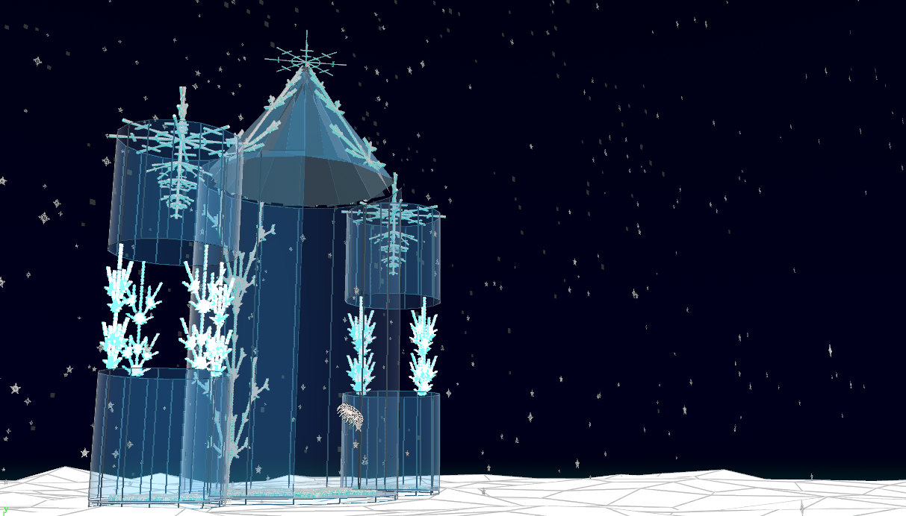

## Introduction to L-systems

An L-System is basically a complex recursive system which consists of:

1. An alphabet of symbols: our components (note that symbols can be abstract)
2. An axiom: initial configuration
3. A grammar: rules that determine what symbols appear in what contexts. Rules have
  - Preconditions
  - Postconditions
  
These symbols can be interpreted as rendering instructions. For example
```
F = draw a line, moving forward
- = rotate(30)
+ = rotate(-30)
[ = save position
] = store position
```
Houdini's L-System Nodes have many such useful symbols and values.

## Snowflakes - 2D L-System

In this project I have used 2D L-systems to generate snowflakes [using this tutorial](https://www.youtube.com/watch?v=KPf9vp1I4k8).

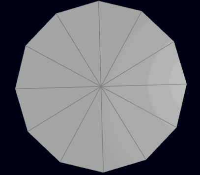

First, I took a segment of a circle and mapped a 2D L-system on it. Using remeshing and color attribute, I procedurally created an L-System mesh to look like an icy, jittered, flat snowflake. Then I mirrored it around with rotation transformation to generate the entire snowflake.
Then I randomized certain parameters liek number of generations and angles to generate random snowflakes.

|Varying over time|Varying across instances|
|---|---|
|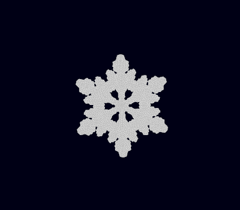|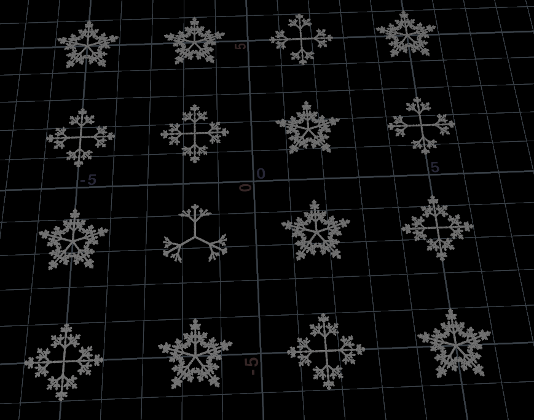|

*Rules*
```
Axiom: X
X=F[+X][-X]FX
F=FF
```

Finally I scattered them across a grid using a noise function, randomized their orientation and added wind/drag nodes to generate snowfall.

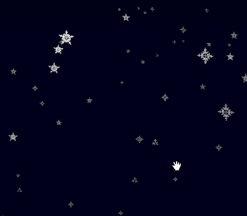


## Ice chandelier - 3D L-System

I used 3D L-system to generate ice chandeliers for my ice palace. It used additional houdini l-system symbols for rotating it about all 3 axes.

|Skeleton|Mesh|Top-view|
|---|---|---|
|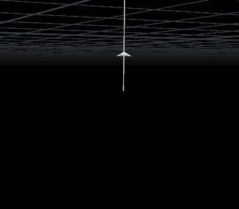|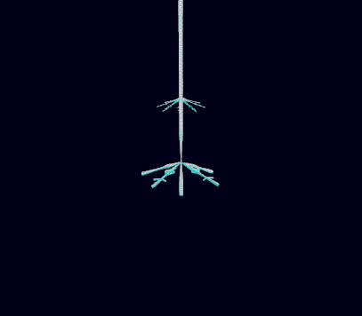|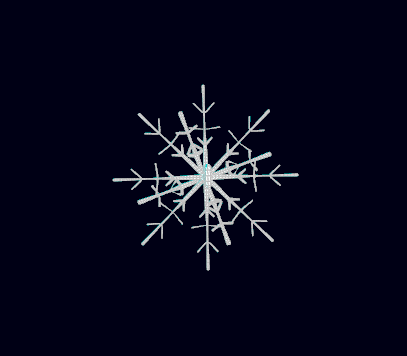|

The chandelier 3 patterns, one at it's tip and two others constantly alternating with each chandelier layer.

*Rules*
```
Axiom: F|FFFX[&A][+B][^C][-D]FF
Rule 1: X=[&A][+B][^C][-D]/(45)[&A][+B][^C][-D]FH"Y
Rule 2: A=F[+"H][-"H]H[;(2)+H][;(2)-H]H[+H][-H]F
Rule 3: B=F[&"H][^"H]H[;(2)&H][;(2)^H]H[&H][^H]F
Rule 4: C=F[+"H][-"H]H[;(2)+H][;(2)-H]H[+H][-H]F
Rule 5: D=F[&"H][^"H]H[;(2)&H][;(2)^H]H[&H][^H]F
Rule 6: Y=[&P][+Q][^R][-S]/(45)[&P][+Q][^R][-S]FF"X
Rule 7: P=F[;;+"H][;;-"H][+"H][-"H]H[+H][-H]H[+F][-F]
Rule 8: Q=F[;;&"H][;;^"H][&H][^H]H[&H][^H]H[&F][^F]
Rule 9: R=F[;;+"H][;;-"H][+"H][-"H]H[+H][-H]H[+F][-F]
Rule 10: S=F[;;&"H][;;^"H][&H][^H]H[&H][^H]H[&F][^F]
```

All of it is parametrized and animated to grow with time variable.


## More L-systems in the scene

Some other L-systems from the scene can be seen below:

|Roof|Walls|Tip|
|---|---|---|
|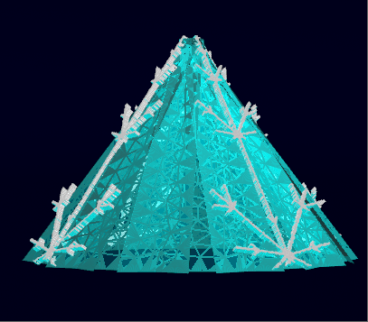|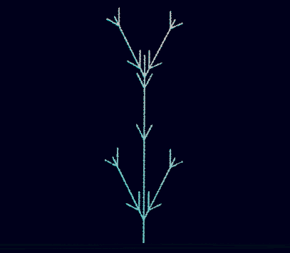|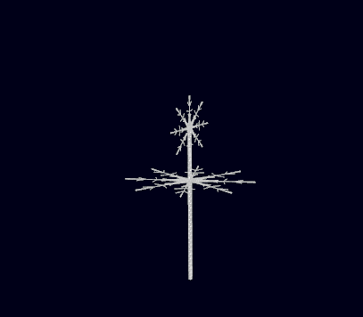|


## Final scene

|Inspiration/Reference|Houdini Render|
|---|---|
|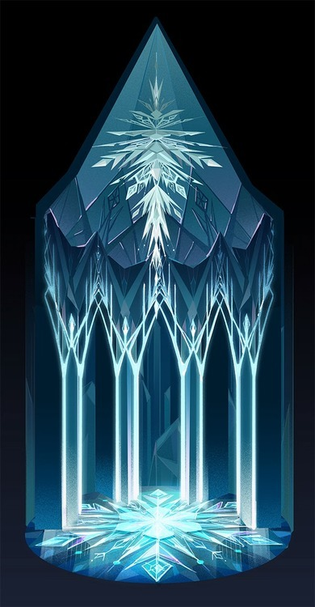||
